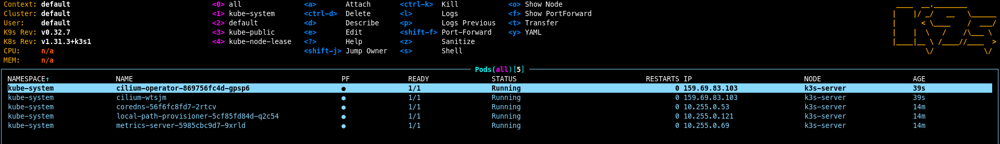
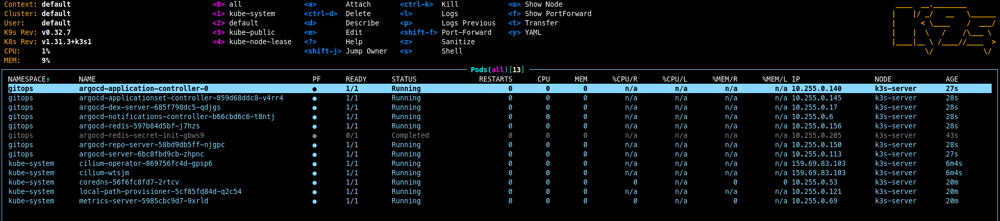

One more thing needs to be preconfigured before we can apply the Argo App of Apps. Take IPs from the Terraform output and add them to [metallb-config.yaml](https://github.com/Ujstor/k3s-single-node-iac/blob/master/helm/system/metallb-config/values.yaml) Helm chart. These IPs will be used by MetalLB to assign external IPs to services.

```bash
metallb-config:
  ipAddressPool:
    addresses:
     - 159.69.83.103/32 # Node ip
     - 116.202.185.83/32 # Floating IP for mailserver

  l2Advertisement:
    enabled: true
```
Push changes to the GitHub repository and ArgoCD will apply them after the next steps.

## Install Cilium:

Change directory to the Cilium Helm chart config and run:

```bash
helm install cilium . -n kube-system
```
Observe in k9s when networking is applied: CoreDNS, local-path-provisioner, and metrics-server pods will be running and cluster IPs will be assigned.



## Install Argo CD:

Create a namespace for Argo CD:

```bash
kubectl create namespace gitops
```

Change directory to the ArgoCD Helm chart config and run:

```bash
helm install argocd . -n gitops
```

Check when ArgoCD is installed, you can do port-forwarding to the ArgoCD pod and log in with the password that can be grabbed from the secrets (use k9s, it's easier than raw kubectl commands). 



Finaly apply `aoa.yaml` in the `gitops` namespace:

```bash
kubectl apply -f ./helm/aoa.yaml -n gitops
```
In 5 minutes, other components of the K3s cluster will be deployed.
